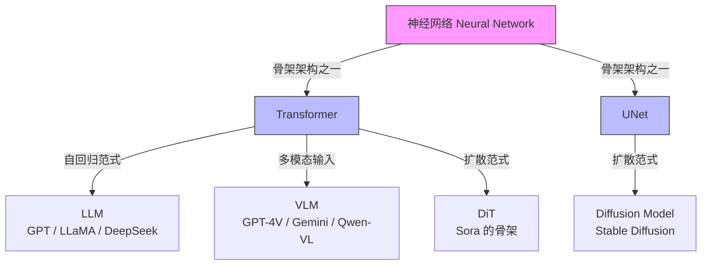
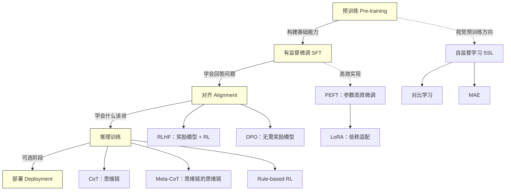
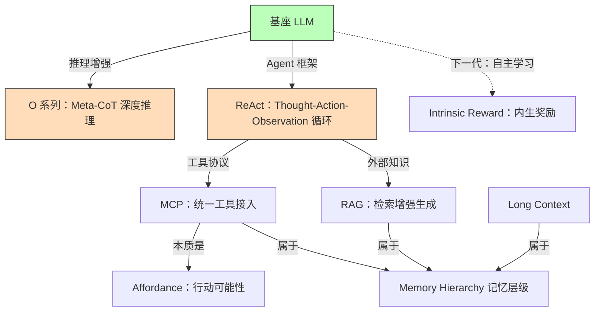
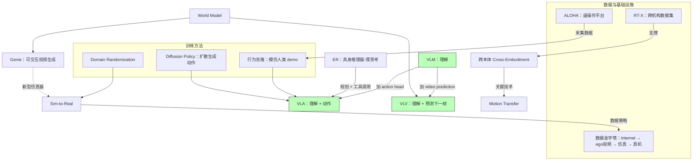

## 概念关系总览

> 先看关系图，再查术语表。以下四张图分别覆盖：模型架构谱系、训练流水线、推理与 Agent 生态、具身智能技术栈。

### 图 1：模型架构与生成范式

神经网络是一切的底座；Transformer 和 UNet 是两种骨架架构；自回归和扩散是两种生成范式；具体模型类型是"骨架 × 范式"的交叉产物。



**关键洞察**：
- **LLM** = Transformer + 自回归（逐 token 生成）
- **传统 Diffusion** = UNet + 扩散（逐步去噪）
- **DiT** = Transformer + 扩散（两者交叉，Sora 的底子）
- **VLM** = Transformer + 多模态输入（图像+文字 → 文字）

### 图 2：训练流水线与方法族谱

从预训练到部署是纵向阶段，每个阶段有横向的具体方法可选。



### 图 3：推理增强与 Agent 生态

基座模型通过推理增强获得深度思考能力，通过 Agent 框架获得行动能力，通过外部系统扩展记忆和工具。



### 图 4：具身智能技术栈

从理解模型到行动模型，从单本体到跨本体，从仿真到真实。




## 基础架构与组件

| 术语                                | 基本定义                                                                                           |
| --------------------------------- | ---------------------------------------------------------------------------------------------- |
| **神经网络 Neural Network**           | 由大量可训练参数组成的函数逼近器。Transformer、UNet 等都是它的具体架构实现。一切现代 AI 模型的底座                                    |
| **Transformer**                   | 2017 年 Vaswani et al. 提出的序列建模架构。基于 self-attention + MLP 堆叠，是现代 LLM / VLM / DiT 的通用骨架           |
| **Attention**                     | 让模型在处理每个 token 时动态关注其他 token 的机制。Transformer 的核心算子；self-attention 是同一序列内的，cross-attention 是跨序列 |
| **Token**                         | 文本被 tokenizer 切出的最小单元（字 / 词 / 子词）。模型其实不认字，只认 token id                                          |
| **Embedding**                     | 把离散的 token id 映射成连续向量。LLM 的"第一层"，也是表征学习的最底层产物                                                  |
| **Autoregressive（自回归）**           | 逐个 token 生成，每一步看前面所有 token 的条件概率。GPT 的生成范式                                                     |
| **Diffusion**                     | 通过逐步去噪（reverse diffusion）从纯噪声生成数据的范式。Stable Diffusion / Sora 的底层算法。与自回归是两种不同的生成范式，共享神经网络底座     |
| **DiT**                           | Diffusion Transformer。用 Transformer 替换 UNet 做 diffusion backbone——是"骨架架构"和"生成范式"的交叉产物，Sora 的底子 |
| **VLM**                           | Vision-Language Model。多模态理解模型，输入图像+文字，输出文字。GPT-4V / Gemini / Qwen-VL 的范式                       |

## 训练阶段

这一列的两个附加维度：是否是"训练阶段"以及是否是"训练方法/技术"——帮助区分统称、阶段、具体方法。

| 术语                                         | 基本定义                            | 是否训练阶段  | 是否训练方法/技术 |
| ------------------------------------------ | ------------------------------- | ------- | --------- |
| **[[预训练-Pretraining\|Pre-training（预训练）]]** | 在海量无标签数据上训练，构建模型基础的语言理解与生成能力    | 是       | 是         |
| **Fine-tuning（微调）**                        | 广义上指在预训练模型基础上进行任何二次训练以适应下游任务    | 是（泛指）   | 是         |
| **[[SFT-有监督微调\|SFT]]**                     | 有监督微调。用"指令-回答"对训练模型遵循人类指令       | 是       | 是         |
| **[[Alignment-对齐\|Alignment（对齐）]]**        | 一系列让模型行为符合人类偏好、价值观和安全规范的训练      | 是       | 是         |
| **[[RLHF-vs-DPO\|RLHF]]**                  | 人类反馈强化学习。主流的对齐方法，使用奖励模型 + 强化学习  | 是       | 是         |
| **[[RLHF-vs-DPO\|DPO]]**                   | 直接偏好优化。对齐方法的一种，无需奖励模型           | 是       | 是         |
| **Post-training**                          | 行业术语，指预训练后的所有训练，**是阶段统称，非独立步骤** | 否（阶段统称） | —         |
| **[[自主学习与在线学习\|自主学习 / 在线学习]]**             | 下一代训练范式，强调模型从自然语言反馈与内生奖励中持续学习   | 是（未来）   | 是（未来）     |

## 训练方法与技术

| 术语 | 基本定义 |
|---|---|
| **[[PEFT-LoRA\|PEFT]]** | 参数高效微调。一种技术类别，只训练一小部分参数 |
| **[[PEFT-LoRA\|LoRA]]** | 低秩适配。一种具体、主流的 PEFT 技术实现 |
| **Rule-based RL** | 基于规则奖励的强化学习。O 系列、DeepSeek R1 广泛使用；直接以"答对/答错"等可判定规则作为 reward |
| **Self-Supervised Learning（SSL）** | 自监督学习。无需外部 label，从数据自身构造监督信号。LeCun "layer cake" 的主体 |
| **Contrastive Learning（对比学习）** | 把相似样本拉近、不相似推远。代表：MoCo / SimCLR / DINO |
| **MAE** | Masked Autoencoder。遮挡图像一部分让模型重建，代表性的 Masked Image Modeling 方法 |
| **[[推理训练-CoT\|CoT]]** | 思维链。让模型显式生成中间思考步骤 |
| **[[推理训练-CoT\|Meta-CoT]]** | 思维链的思维链。通过反思 pattern 在多种 CoT 模式间切换。O 系列的核心 |
| **Behavior Cloning / Imitation Learning** | 行为克隆 / 模仿学习。从人类遥操作 demo 监督式学动作，VLA 的主流训练范式 |
| **Diffusion Policy** | 用 diffusion 生成连续动作序列的机器人控制方法。VLA action space 的三大表示之一 |
| **Domain Randomization** | 训练时随机化光照 / 纹理 / 物理参数，让策略对一个分布都 robust——真实只是样本之一。经典 sim-to-real 手段 |

## 表征学习与世界模型

| 术语 | 基本定义 |
|---|---|
| **[[表征学习-RepresentationLearning\|Representation Learning（表征学习）]]** | 把数据映射到"良好性质"的空间，使下游任务变容易 |
| **[[世界模型-WorldModel\|World Model（世界模型）]]** | 根据当前 state + action 预测下一个 state 的函数。不是具体技术，是 AGI 架构的目的 |
| **[[JEPA-联合嵌入预测架构\|JEPA]]** | Joint Embedding Predictive Architecture。LeCun 2022 提出，在表征空间而非像素空间做预测 |
| **Cognitive Architecture** | 认知架构。不是算法，是 understanding + prediction + planning 的集成框架 |
| **[[Bitter-Lesson\|Bitter Lesson]]** | Sutton 2019。70 年 AI 史证明：scale 算力的通用方法（search + learning）最终超过依赖人类知识的方法 |
| **[[Moravec悖论\|Moravec 悖论]]** | "难的容易、容易的难"——AI 擅长人类觉得难的（数学、棋），不擅长人类觉得简单的（抓杯子、走路） |
| **MPC（Model Predictive Control）** | 控制论经典。给定 world model，rollout 多条 action trajectory，选 cost 最低的——送月球探测器就靠这个 |
| **P(Y) vs P(X\|Y)** | 建模对象差异。LLM 建 P(Y)（低维 label 谁更可能）；视频生成建 P(X\|Y)（给定语义 pixel 怎么长）——后者信息量远大 |

## 推理与 Agent 架构

| 术语 | 基本定义 |
|---|---|
| **O 系列** | OpenAI 的 reasoning 模型系列（o1 / o3 等），通过 Meta-CoT 实现深度推理 |
| **[[REACT-推理与行动架构\|ReAct]]** | Reasoning + Acting。Agent 架构，推理(Thought) / 行动(Action) / 观察(Observation) 循环 |
| **[[Code-AI的Affordance\|Affordance]]** | 认知科学概念——环境给智能体提供的行动可能性 |
| **[[RAG-检索增强生成\|RAG]]** | 检索增强生成。一种系统架构，而非训练 |
| **MCP** | Model Context Protocol。让模型触达外部 SaaS/工具的统一协议，本质是 affordance 暴露框架 |
| **Memory Hierarchy** | 冯诺依曼概念。环境永远是记忆层级的最外层；Long Context / RAG / MCP / 持续学习 是同一问题的不同层路径 |
| **Environment Scaling** | 环境扩展性。RL 训练环境的工程成本瓶颈 |
| **Intrinsic Reward（内生奖励）** | 非外部评分，模型/智能体自发的价值判断（好奇心、掌控感、安全感） |

## 机器人与具身智能

| 术语 | 基本定义 |
|---|---|
| **[[VLA-视觉语言动作模型\|VLA]]** | Vision-Language-Action Model。输入图像+指令，输出机器人动作。本质是 VLM 的 action 版微调 |
| **VLV** | Vision-Language-Vision。VLA 的演进猜想——不直接出 action，而是预测下一帧图像（即 world model） |
| **ER（Embodied Reasoner）** | 具身推理器。Gemini Robotics 1.5 的慢思考模块，负责规划 + 工具调用，与 fast VLA 配对 |
| **[[具身智能-EmbodiedAI\|具身智能（Embodied AI）]]** | AI 进入一个能感知 / 行动的身体，和物理世界交互。分"大脑（认知）+ 小脑（灵巧）"两层 |
| **[[跨本体-CrossEmbodiment\|跨本体（Cross-Embodiment）]]** | 一个模型在不同形态机器人上通用。机器人基座模型能否 scale 的关键——单本体数据凑不齐 GPT-3 规模 |
| **Motion Transfer** | Gemini Robotics 1.5 的关键技术——通过架构 + 训练 recipe 让动作知识跨本体迁移 |
| **[[Sim-to-Real]]** | 在仿真器里训练策略再部署到真实机器人。Locomotion 已靠它解决，Manipulation 还没 |
| **Data Pyramid（数据金字塔）** | 谭捷的数据策略：internet 多模态 → 人类 ego 视频 → 仿真 → 真机遥操作。越底越大越便宜，越顶越准越贵 |
| **ALOHA** | Stanford 2023 推出的桌面双臂遥操作平台。低成本，是大量模仿学习工作的硬件基础 |
| **Open X-Embodiment / RT-X** | 跨机构联合数据集，22 种本体 + 160k 轨迹。跨本体研究的数据基础 |
| **Gemini Robotics 1.5** | Google DeepMind 2025 发布的机器人基座模型，ER-VLA 分层 + Motion Transfer |
| **Genie** | Google DeepMind 的可交互视频生成模型。逐帧可塞 action——是真正意义上可当仿真用的 world model |

## 评估指标

| 术语 | 基本定义 |
|---|---|
| **Pass@k** | k 次采样中至少有 1 次成功就算过。标准代码 / 数学 benchmark 指标 |
| **Pass@head k** | 要求连续前 k 次全部成功才算过。由 TauBench 提出，更贴近"可靠性"任务 |

## 阶段间的逻辑顺序

一个模型从诞生到可用的典型路径：

```
Pre-training
     ↓
Fine-tuning (以 SFT 为代表)
     ↓
Alignment (RLHF / DPO)
     ↓
Reasoning (可选，CoT / Meta-CoT)
     ↓
Deployment (Adapter 组合 → 上线)
```

### 各阶段的作用

1. **Pre-training**：一切能力的基础，学习语言统计规律，构建"世界模型"。企业实践中直接从开源预训练模型起步。
2. **Fine-tuning（以 SFT 为代表）**：把预训练模型"改造"成能理解并回答问题的对话助手。
3. **Alignment**：对价值观和行为"精雕细琢"，建立在 SFT 之上，让模型知道在多个"能说"的答案中哪个"更应该说"。可以独立，也可以与 SFT 融合。
4. **Reasoning（可选）**：通过 CoT / Meta-CoT 等技术降低回答方差，绕开 NTP 的单步复杂度上限。
5. **Deployment**：把各阶段的 Adapter 组合、评测、签批、上线。

## 容易混淆的几组概念

1. **SFT vs Alignment**：SFT 是人类**写答案**，Alignment 是人类**判答案**。
2. **Fine-tuning vs PEFT vs LoRA**：Fine-tuning 是广义的"再训练"阶段；PEFT 是"只训练少量参数"的技术类别；LoRA 是 PEFT 的一种具体实现。
3. **微调 vs RAG**：微调是**改模型权重**，RAG 是**改输入上下文**。见 [[微调vs RAG-决策]]。
4. **CoT vs Meta-CoT**：CoT 是一条线性思考链；Meta-CoT 是允许在多条 CoT 之间切换、回退、重试的元思维链（O 系列的核心）。
5. **VLA vs VLM**：VLM 输入图像+文字 → 输出文字；VLA 多一步 action head → 输出机器人动作。
6. **World Model vs Video Generation**：生成视频只要"看起来对"就行；World Model 要求"给 action 能预测下一帧"（交互性）。见 [[世界模型-WorldModel]]。
7. **Transformer vs Diffusion**：不是同一层面的概念。Transformer 是骨架架构（类似"发动机类型"），Diffusion 是生成范式（类似"驱动方式"）。DiT 就是 Transformer 骨架 + Diffusion 范式的组合。

## 相关页面

- [[LLM训练四阶段总览]] — 这些术语如何串成一条链路
- [[预训练-Pretraining]]
- [[SFT-有监督微调]]
- [[Alignment-对齐]]
- [[RLHF-vs-DPO]]
- [[PEFT-LoRA]]
- [[推理训练-CoT]]
- [[RAG-检索增强生成]]
- [[微调vs RAG-决策]]
- [[NTP的本质缺陷]]
- [[REACT-推理与行动架构]] — ReAct 详解
- [[Code-AI的Affordance]] — Affordance 详解
- [[自主学习与在线学习]] — Intrinsic Reward 详解
- [[LongContext与分层记忆]] — Memory Hierarchy 与冯诺依曼视角
- [[世界模型-WorldModel]] — World Model 详解
- [[JEPA-联合嵌入预测架构]] — JEPA 详解
- [[表征学习-RepresentationLearning]] — SSL / Contrastive / MAE 详解
- [[Bitter-Lesson]] — Sutton 论点及争议
- [[Moravec悖论]] — Moravec 悖论在 LLM 时代的再印证
- [[具身智能-EmbodiedAI]] — 机器人 / 具身子域入口
- [[VLA-视觉语言动作模型]] — VLA / ER-VLA / 动作空间表示
- [[跨本体-CrossEmbodiment]] — Motion Transfer / Embodiment Gap 详解
- [[Sim-to-Real]] — 数据金字塔 / Genie 型新仿真
